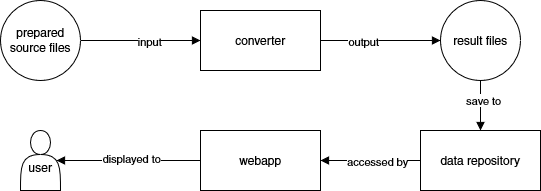

# TUDelft Co-Lab Research Mapping Converter

This is a tool for converting housing data collected from multiple sources into the format developed by the [Co-Lab Research](https://co-lab-research.net/) team of [Delft University of Technology](https://www.tudelft.nl/en/).  
The converted data can then be displayed by the [mapping webapp](https://mapping.co-lab-research.net/).

## How it works

## Links

- [Mapping data](https://github.com/odqo/tudelft-colabresearch-mapping-data)
- [Mapping webapp](https://github.com/odqo/tudelft-colabresearch-mapping-webapp)

## Requirements

- [Python 3.9.x](https://www.python.org/)
- [pip](https://pypi.org/project/pip/)

## Initialization

Install the dependencies:

    pip install -r requirements.txt

## Usage

### Import a dataset

Overview:

- You must provide one project listing file per source per country.
- Multiple sources per country are allowed and not all countries must have a source.
- Each source file must be correctly formatted for the import script to succeed.

How to:

1. In the [sources.csv](./data/input/sources.csv) file add your source on a new line and save your modification (use [Visual Studio Code](https://code.visualstudio.com/)).  
The line number of your source minus 1 will be this source's **source_id**.
2. Download the [country_import_model.csv](./doc/country-normal/country_import_model.csv).
3. Import your data to the file:

   1. Import the CSV file to Excel (choose the `;` delimiter).
   2. Paste your data column by column.
   3. Control the syntax and the data.

      The data of your CSV file must adhere to this structure:

      | Column            | Type    | Allowed values                                       |
      |-------------------|---------|------------------------------------------------------|
      | name              | string  | any                                                  |
      | development_stage | string  | [list of allowed slugs](./classification/development_stages.csv) |
      | completion_year   | integer | any                                                  |
      | dwellings_number  | integer | any                                                  |
      | address_line1     | string  | any                                                  |
      | address_region    | string  | any                                                  |
      | address_code      | string  | any                                                  |
      | housing_tenure    | list    | [list of allowed slugs](./classification/housing_tenures.csv)    |
      | legal_form        | list    | [list of allowed slugs](./classification/legal_forms.csv)        |

      Syntax of a list:

          ['element 1', 'element 2']

      Syntax of an empty list:

          []

    4. Save the file to `./data/input/normal` and name it  `source_id.csv` (the *source_id* being the above described number).
    5. Open the file in Visual Studio Code, _find-replace_ all the `;` by `|` and save.
   
4. Run the converter tool:
   
       python converter.py

5. To display the newly imported data on the [webapp](https://github.com/odqo/tudelft-colabresearch-mapping-webapp), you must upload the [output files](./data/output/) (all but the `.gitignore`) to the [data repository](https://github.com/odqo/tudelft-colabresearch-mapping-data).

### Import a custom dataset

This project began with the aim to automatically convert and import datasets from given national sources, then it evolved into a tool that only automates the import and for which the conversion is done manually.

[See the documentation related to the initial custom datasets.](doc/country-custom/readme.md)

## More

[Output project data structure](./doc/output-data-structure.md)
